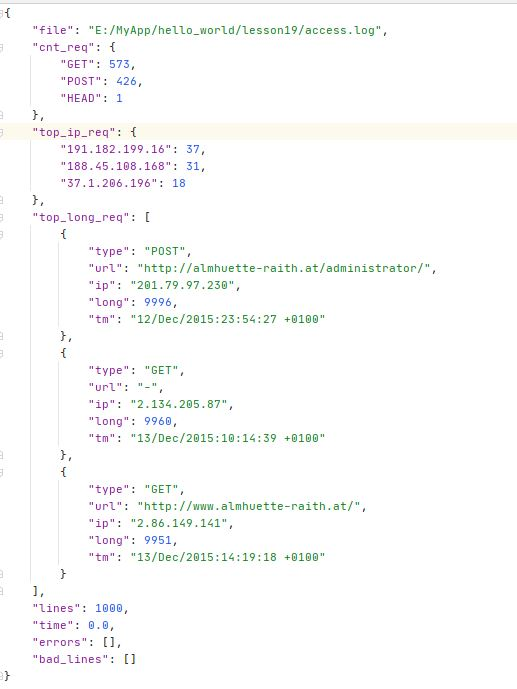

## Ключи

- -f - файл или директория. Если задана директория, то обработаются все дочерние файлы .log. Если не задано - 
обрабатываются все дочерние файлы .log текущей директории
- -с - лимит обработки строк. Если не задано - обработается весь файл
- --top_long_cnt - топ самых долгих запросов
- --top_ip_cnt - топ IP адресов, с которых были сделаны запросы

## Пример вызова

    python -m lesson19 -f e:/MyApp/hello_world/lesson19 -c 1000000 --top_long_cnt 1 --top_ip_cnt 1
    
По ходу работы выводится текущий прогресс обработки    
    
## Результат работы    
Для каждого обработанного файла создаётся файл .json с тем же именем и шаблоном:

- file - обработанный файл
- lines - кол-во бработанных строк
- time - время выполнения
- cnt_req - кол-во запросов каждого типа
- top_ip_req - топ IP адресов по кол-ву запросов
- top_long_req - топ самых долгих запросов и информация по ним
- errors - примеры запросов, которые парсились с ошибкой
- bad_lines - примеры строк, которые не удалось распарсить

